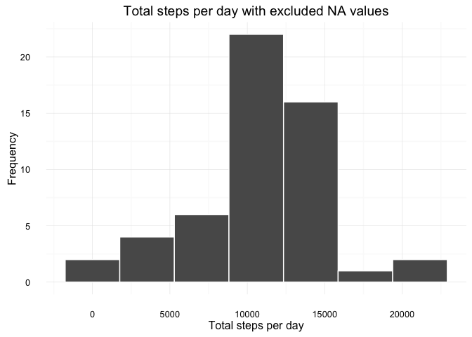
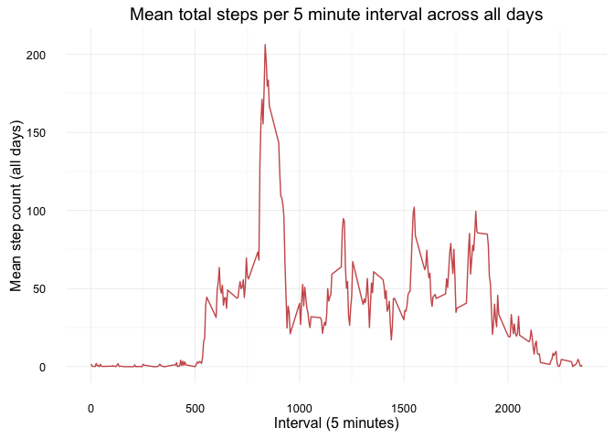
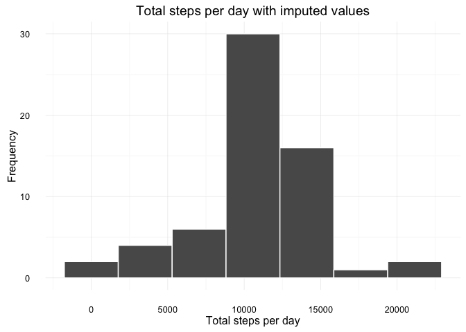
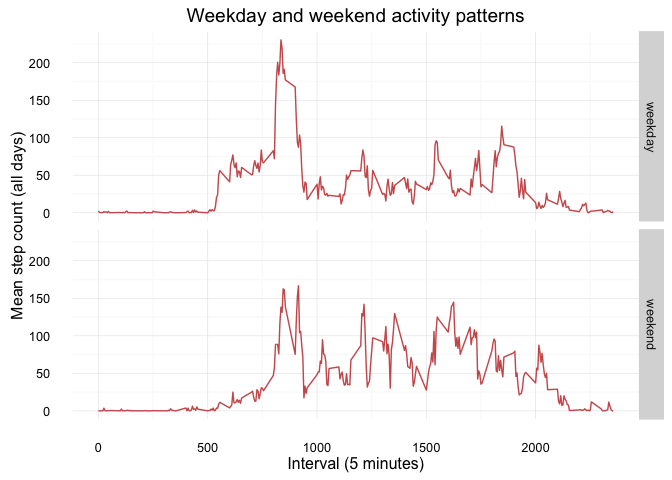

# Reproducible Research: Peer Assessment 1

## Loading and preprocessing the data

Inital setup code loads three packages used for processing and plot the data.  
It is assumed activity.csv or the activity.zip archive is present in the working directory. 

```r
library(data.table)
library(ggplot2)
library(chron)

## Unzip data file, if neccessary
if (!file.exists("activity.csv")){
unzip("activity.zip")
}
```

Preprocessing is limited to converting the date column to class **Date**, using the colClasses option.  
**setDT** is used to convert the imported data.frame to a data.table without copying the original data.


```r
act_data <- read.csv("activity.csv", stringsAsFactors = FALSE,
                      colClasses = c("integer", "Date", "integer"))

## Convert to a data.table
setDT(act_data)
```

## What is mean total number of steps taken per day?

To calculate the total steps per day the orignal data is filtered to remove rows containing NA in the steps column.  The filtered data is grouped by date, and the sum of step counts for each date calculated.

```r
steps_day <- act_data[!is.na(steps), .(step_sum = sum(steps)), by=date]
```

The total steps per day are plotted as a histogram using the ggplot2 package geom_histogram function.  The value for the **bins** parameter is calculated by taking the square root of the number of observations.

```r
bincount <- sqrt(length(steps_day$step_sum))

ggplot(steps_day, aes(step_sum)) + geom_histogram(bins = bincount, colour = "white") +
    labs( x="Total steps per day", y= "Frequency") +
    ggtitle("Total steps per day with excluded NA values") +
    theme_minimal()
```

<!-- -->

Calculate the mean and median values from the daily total steps. 

```r
step_summary <- steps_day[, .(step_mean = as.integer(mean(step_sum)),
                        step_median = as.integer(median(step_sum)))]
```
 
With missing values excluded, the mean total steps per day is 10766, and the median total steps per day is 10765.

## What is the average daily activity pattern?

Filter out rows containing NA step values, group by interval and calcuate the mean step count per interval.

```r
step_int <- act_data[!is.na(steps), .(step_mean = mean(steps)), by=interval]
```

Plot the time series using ggplot and geom_line.

```r
ggplot(step_int, aes(interval, step_mean)) +
    geom_line(colour = "indianred", show.legend = FALSE) +
    labs( x= "Interval (5 minutes)", y = "Mean step count (all days)") +
    ggtitle("Mean total steps per 5 minute interval across all days") +
    theme_minimal()
```

<!-- -->

Select the data row containing the maximum mean step count.

```r
stepmax <- step_int[which.max(step_int$step_mean),]
```
The interval with the highest mean step count across all days was 835 with mean count  steps.

## Imputing missing values  

Count the occurances of NA in the original steps data.

```r
na_count <- sum(is.na(act_data$steps))
```
The activity dataset contains 2304 rows where the step value is NA.  

The strategy used to impute the missing values is to take the mean of the 5 minute interval for across all days, and use these values to replace the NA's.  


```r
## calculate step mean by interval
act_data_imp <- act_data[, .(steps, date,
                            steps1 = round(mean(steps, na.rm = TRUE))),
                           by=.(interval)]
```

NA values are replaced with the mean value for the matching interval. 

```r
act_data_imp[is.na(steps), steps := as.integer(steps1)]
```

Clean up is done to remove working columns, and reorder the modified data  by date to match the original data set.

```r
## Delete working variables
act_data_imp[, steps1 := NULL]

## Reorder by date
act_data_imp <- act_data_imp[order(date)]

## Reset column order to match original
setcolorder(act_data_imp, c("steps", "date", "interval"))
```

Calculate total steps per day with imputed values.

```r
imp_day <- act_data_imp[, .(step_sum = sum(steps, na.rm = TRUE)), by=date]
imp_summary <- imp_day[,.(step_mean = mean(step_sum), step_median = median(step_sum))]
```

The total steps per day with imputed values are plotted as a histogram using the ggplot2 package geom_histogram function.


```r
ggplot(imp_day, aes(step_sum)) +
    geom_histogram(bins = bincount, colour = "white") +
    labs( x="Total steps per day", y= "Frequency") +
    ggtitle("Total steps per day with imputed values") +
    theme_minimal()
```

<!-- -->

With imputed values replacing the NA step counts the daily mean step count is 10765. The daily median step count is  10762.  

The mean and median with imputed values have a small shift compared with the excluded values. This shift appears to be caused by an error introduced in rounding the imputed step count to whole numbers.

## Are there differences in activity patterns between weekdays and weekends?

The **is.weekend** function from the chron package is used to create a logical vector from the date column. The locgical vector is then converted to a factor with two levels - weekday, and weekend.

The imputed data is grouped by interval and weekday/weekend factor, and the mean step count calculated for each group.

```r
## Create factor by reference, using is.weekend function from chron package
act_data_imp[, wend := factor(is.weekend(date),
                             labels = c("weekday", "weekend"))]

ww_steps <- act_data_imp[, .(ssum = mean(steps)), by = .(interval, wend) ]
```

ggplot2 **facet_grid()** and **geom_line()** functions are used to create a panel plot with
a time series plot for weekday and weekend step count per interval averaged across all days. 

```r
ggplot(ww_steps, aes(interval, ssum)) +
    geom_line(colour = "indianred", show.legend = FALSE) +
    facet_grid(wend~.) +
    scale_x_continuous(name = "Interval (5 minutes)") +
    scale_y_continuous(name = "Mean step count (all days)") +
    ggtitle("Weekday and weekend activity patterns") +
    theme_minimal() +
    theme(
        strip.background = element_rect(fill = "grey85", colour = "grey85")
    )
```

<!-- -->
